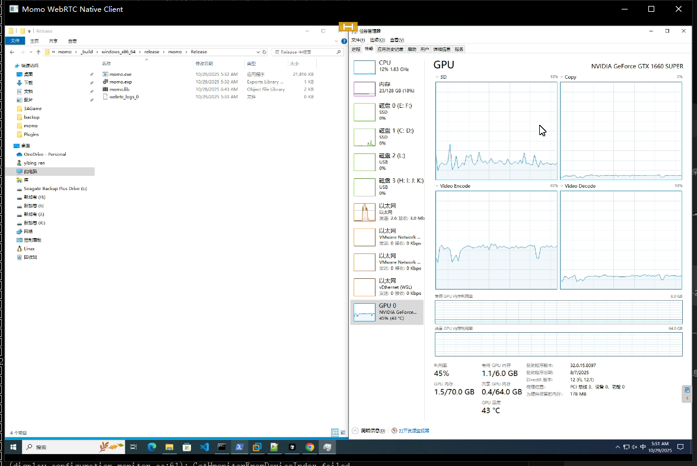
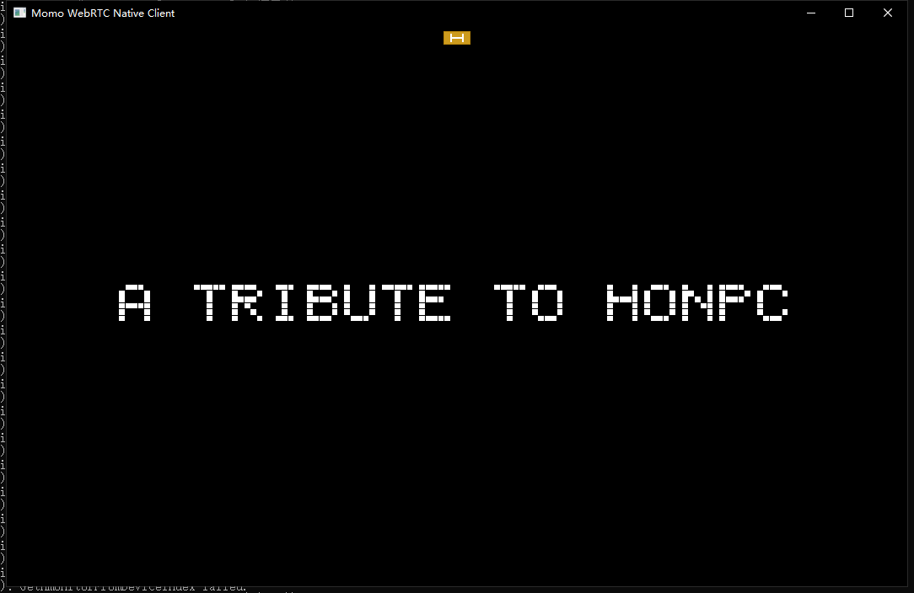

# 🚀 WebRTC Remote Desktop & Cloud Gaming Platform (Based on Momo + SDL)

AI-Ready ultra-low-latency remote desktop, cloud gaming, and interactive streaming platform.  
Supports keyboard/mouse/gamepad input, P2P & relay mode, H.264/H.265/AV1/VP8/VP9, and cross-platform builds (Windows / macOS / Linux / Android / iOS).

---

## 🔥 Why this project?

✅ WebRTC native remote desktop (SDL receiver, <60 ms latency)  
✅ Cloud gaming & edge-AI streaming (H.264/H.265/AV1, hardware encoder support)  
✅ Full input control: keyboard / mouse (with cursor overlay) / gamepad / touch  
✅ Works in **P2P mode (LAN)** or **Relay mode (Ayame signaling, NAT traversal)**  
✅ Extendable for **AI agents, cloud workflow automation, remote GPU rental, etc.**

> 🆕 Unlike original Shiguredo Momo, this fork adds **remote-control features**, virtual input handling, libuiohook keyboard hook, mouse overlay rendering, and AI-integrated workflow support.

---

## 🧠 Roadmap toward AI-powered remote computing

| Feature | Status |
|---------|--------|
| WebRTC remote desktop streaming | ✅ |
| SDL receiver + input injection | ✅ |
| Virtual keyboard & mouse overlay | 🚧 (in progress) |
| AI agent embedding (AutoGen / Coze / Dify) | 🧪 experimental |
| Cloud desktop rental / billing model | 🧩 planned |

---

## 🙏 Credits

This project is built on top of **WebRTC Native Client Momo** (Shiguredo).  
Original repo: https://github.com/shiguredo/momo  
Extended & maintained by **Bob Haskins** — adding remote-control, AI workflow, and cloud-gaming features.

---

## 🖼️ Preview

| Desktop Control | Cloud Workflow |
|-----------------|----------------|
|  |  |

---
